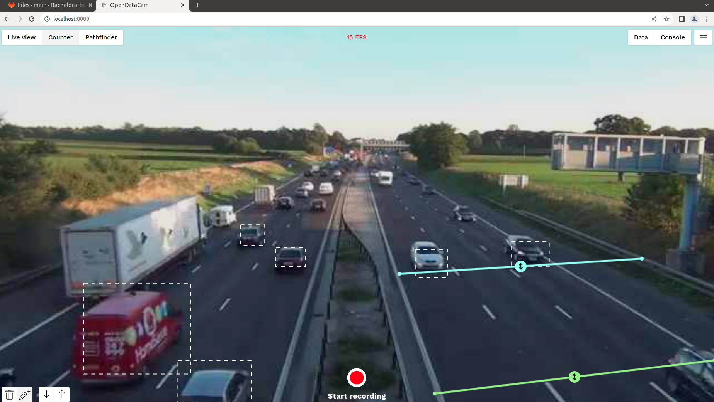
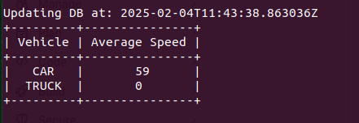
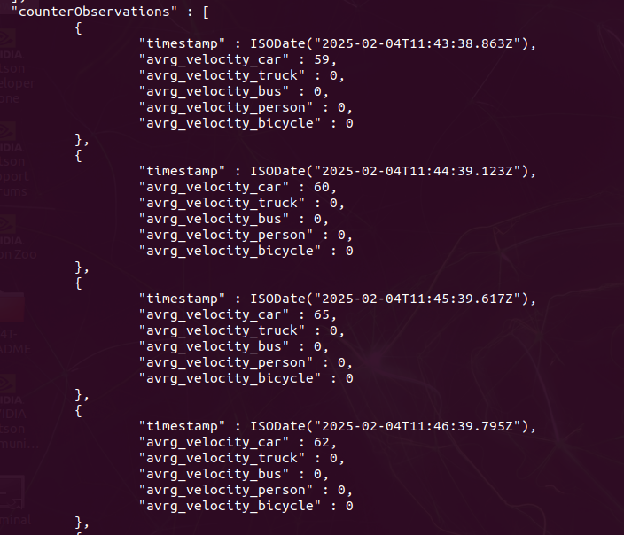
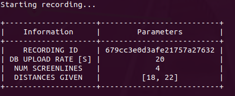

# OpenDataCam_SpeedDetection

Speed Detection for OpenDataCam

## Description
The [OpenDataCam](https://opendata.cam/) Software allows for counting moving objects such as cars, trucks and people using minimal hardware and a camera. It has been used in the area of urban planning to analyze traffic behavior or people density in places like [Berlin](https://www.tandfonline.com/doi/full/10.1080/21650020.2021.1950044#d1e389) or [Pretoria](https://www.sciencedirect.com/science/article/pii/S2666691X21000245). Eventhough the software provides enough information via its [API](https://opendatacam.github.io/opendatacam/apidoc/#api-Recording-Counter_data), it does not provide a speed detection option. This project aims to fill that gap and let the user measure the speed using OpenDataCam.

## Features
What you can do with this script:
- Measure speeds of all detected vehicles in a recording 
- Measure speeds on more than one area. For example in two highway lanes
- Define the distance over which the velocity is being measured
- Access the measured data in OpenDataCam's MongoDB.
- Define the upload rate to which data is uploaded to the database

## Installation
Download the zip file of this project or clone it to any directory.

Install the dependencies: `$pip install -r requirements.txt`

## Usage
1. Open the Browser at localhost:8080 where you will see the OpenDataCam graphic interface
2. Drag and drop a test video to the graphic interface
3. Draw two Screnlines on the graphic interface. The first screenline (light blue) will be the starting measuring point and the second screenline(light green) will be the end measuring point. Name the first line "1" and the second line "2". Keep enough distance between the lines. Example depicted in following image

   

4. In the same directory of the files run the project in the terminal:
`$sudo python3 main.py`
If you already now the distance (in meters) between the two lines you can pass them as parameters. For example for a distance of 20 meters: 
`$sudo python3 main.py --distance 20`
5. The project will start recording the test video, counting vehicles and measuring speed of the detected vehicles between the first and second screenlines.To stop the recording press 'q' on the terminal.

6. As long as the recording goes on, the average of the calculated speeds will be automatically uploaded to OpenDataCam's MongoDB. Per default the upload will occur every 30 seconds. This means only the average of speeds in the latest 30 seconds will be uploaded to the Database.

    If you wish to define another upload rate, for example   every 60 seconds you can start the script with:

    `$sudo python3 main.py --distance 20 --db_upload_rate 60`
7. While the script is running you can take a look at the information displayed in real time on the terminal. Everytime the script uploads information to the database this information will also be displayed in the terminal.
This will occur every 60 seconds just as we have defined in the upload rate above. 

   

8. After a recording is stopped, take a look at the uploaded data with the following commands on the terminal:

    `$mongo mongodb://127.0.0.1:27017`

    `use opendatacam`

    `db.recordings.find().pretty()`

    The data has been uploaded to a section called "counterObservations".
    Notice that the information has been uploaded with 60 seconds interval.

   

## Usage for multiple speed measurements
If you wish to have more than one speed measurement on a recording, for example on two highway lanes follow the instructions.

1. Add two more screenlines to the recording. Name the starting screenline (white) "3" and the ending line (dark green) "4". Depicted in the following picture:

   

2. When starting the script introduce the distances between screenlines 1 and 2 (first argument) and between screenlines 3 and 4 (second argument)

   `$sudo python3 main.py --distance 18 22`

   Meaning distance between screenlines 1 and 2 is 18 meters. Distance between screenlines 3 and 4 is 22 meters.

3. When the script has started the recording, a small information window will appear in the terminal screen. make sure that the number of distances entered as parameters makes sense with the number of screenlines present in the recording. For 4 screenlines present in the recording 2 distances must be given. 

   

